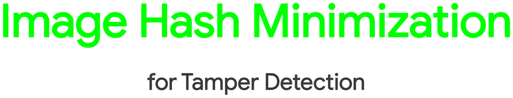
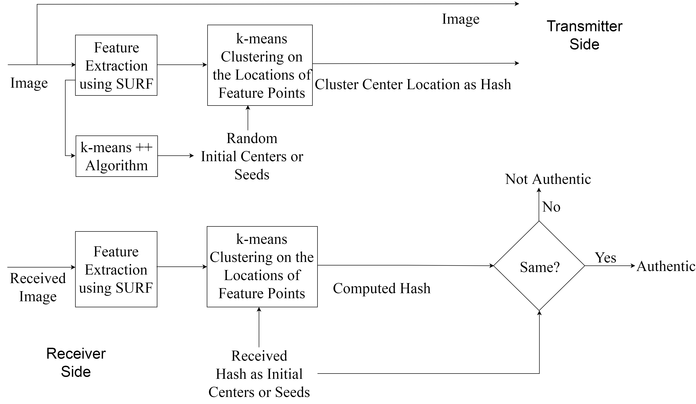
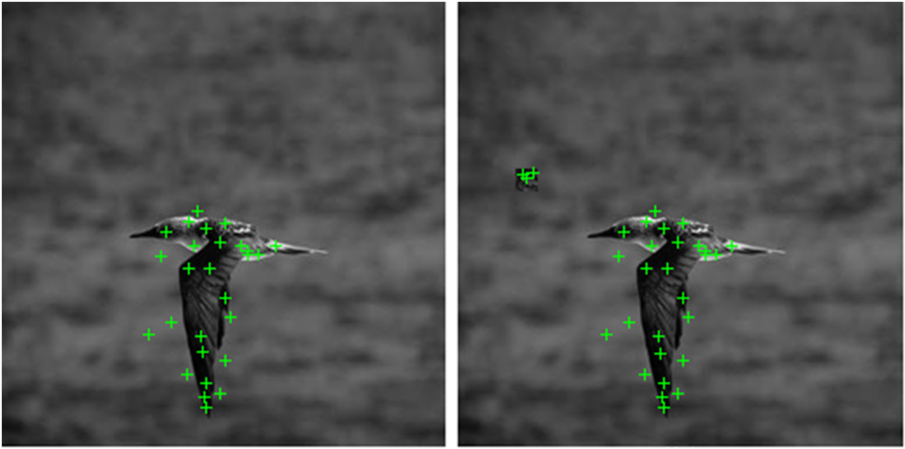

<div align="center">
   <!-- <link href='https://fonts.googleapis.com/css?family=Raleway' rel='stylesheet'>
   <style>
      /* @font-face {
      font-family: 'Raleway';
      src: url('https://fonts.googleapis.com/css?family=Raleway');
      } */
      .container {
      width: 100%;
      height: 7vh;
      display: flex;
      flex-direction: column;
      justify-content: center;
      align-items: center;
      font-size: 60px;
      text-transform: uppercase;
      font-family: 'Raleway';
      letter-spacing: -3px;
      transition: 100ms ease;
      font-variation-settings: "wght" 311;
      margin-bottom: 0.8rem;
      color: #66ff00;
      outline: none;
      text-align: center;
      }
      .container:hover {
      font-variation-settings: "wght" 582; 
      letter-spacing: 1px;
      }
   </style> -->
	<!-- <br> -->
	<center></center>
   <br>
   <!--  -->
   <center><a href="https://www.isical.ac.in/~icapr17/"></a></center>
	<br>
   <center>
      <!-- <p class="container"><b><a href="https://www.isical.ac.in/~icapr17/" style="text-decoration:none; color: #66ff00;" >ICAPR 2017</a></b></p>&nbsp; -->
      <!--  -->
      <a href="https://doi.org/10.1109/ICAPR.2017.8593100"></a>
      <a href="https://arxiv.org/abs/2305.17748"></a>
      <a href="https://maitysubhajit.github.io/ImageHashMinimization/"></a>
      <a href="https://github.com/MaitySubhajit/ImageHashMinimization"></a>
      <br>
      <a href=""></a>
      <a href=""></a>
      <a href="https://github.com/MaitySubhajit/ImageHashMinimization/blob/main/LICENSE"></a>
      <br>
      <br>
      <br>
   </center>
</div>

# [ICAPR 2017] Image Hash Minimization for Tamper Detection :fire:
This is the official implementation for the paper [Image Hash Minimization for Tamper Detection](https://ieeexplore.ieee.org/document/8593100) by [S. Maity](https://maitysubhajit.github.io) and [R. K. Karsh](http://ec.nits.ac.in/ram/) published at [ICAPR 2017](https://www.isical.ac.in/~icapr17/).

:pushpin: [Requirements](#rocket-requirements)

:pushpin: [Guidelines to Use](#pencil-guidelines-to-use)

:pushpin: [FAQ](#mag-faq)

:pushpin: [Citation](#bibtex)

### Methodological Flow
<div align="center"><center></center></div>

### Sample Qualitative Depiction
<div align="center"><center></center></div>

### Quantitative Performance Measures
|                                        |      Pun _et al._      |      Ours      |
|:---------------------------------------|:----------------------:|:--------------:|
| Hash Length                            |  634 digits            | 64 bits        |
| Robustness against Noise & Compression |    Yes                 |   Yes          |
| Detection Accuracy                     | 60% Approximately      |    77%         |

## :rocket: Requirements
- Mathworks MATLAB R2016b or later versions

## :pencil: Guidelines to Use

:white_check_mark: [Dataset](#Dataset)

:white_check_mark: [Running the Scripts](#Running-the-Scripts)

### Dataset   
- To test the accuracy of our model, we have used CASIA 2.0 dataset which is no longer available from its official source. However, the official dataset as well as a correctly annotated version can be downloaded from [here](https://github.com/namtpham/casia2groundtruth).
- The dataset we curated having 200 tampered images with tampered area <5% is a private dataset and is unavailable for usage.
- The dataset should be extracted to have the following structure.
    
```
├── dataset                      # Dataset root directory
   ├── CASIAv2                   # CASIAv2.0 dataset root directory
      ├── original               # Directory containing original images
      |  ├── 1.jpg
      |  ├── 2.jpg
      |  ├── ...
      |
      └── tampered               # Directory containing tampered images
         ├── (1).jpg
         ├── (2).jpg
         ├── ...
```

- The images in the 'original' image directory has naming convention as <image_number>.jpg and the images in the 'Tampered' image directory has naming convention as <(image_number)>.jpg for the corresponding original and tampered image pairs. The image numbers should be consecutive without any break.

### Running the Scripts
1. Open the `codes` directory in MATLAB.
2. Set the path and hyper-parameters in `data_from_original.m` and `data_from_tampered.m`. To imitate our process, ensure `K=1` as we used sinlhle cluster to determine the deviation of the centroid. The hyper-parameter, threshold `thres` for the strength of the SURF features detected in the images needs to be tuned according to the dataset. The proper CASIAv2.0 root pathe should be provided in the `dataset_path` and the `count` should be set as the total number of original and tampered image pairs.
```
count = 30;                                               % number of samples <n> in dataset
K = 1;                                                    % setting the number of clusters to be formed
thres = 1000;                                             % setting the threshold for SURF feature strength
dataset_path = 'path/to/dataset/root/CASIAv2/';           % setting the dataset path
maxiter_k = 1000000;                                      % setting up the maximum iterations for clustering
``` 
3. Run `data_from_original.m` script and make sure that the centroids are saved as `centers_original.mat` in the `codes` directory. The script will provide visualization of the SURF features extracted from each of the original images.
4. Run `data_from_tampered.m` script and make sure that the centroids are saved as `centers_tampered.mat` in the `codes` directory. The script will provide visualization of the SURF features extracted from each of the tampered images.
5. Set relevant parameters in `tampered.m`. The `count` should be set as the total number of original and tampered image pairs and `K=1` for imitating the method described in the paper, same as `data_from_original.m` and `data_from_tampered.m`.
```
count = 30;                                               % number of samples <n> in dataset
K = 1;                                                    % setting the number of clusters to be formed
```
6. Run `tampered.m` script. The script will print out tampered or not-tampered status for each sample in the dataset and save the Euclidean distance matrix in a file named `distance.mat` where `NaN` represents the images which are not tampered.

## :mag: FAQ
- The k means clustering inital seed is chosen by k means ++ algorithm. It can also be chosen at random.
- With different seeds either from k means ++ or random may result in minor deviation from the reported accurcy.
- We recommend using the k means ++ as it generates more stable seeds than the random strategy.

## BibTeX  
If you use our code for your research, please cite our paper. Many thanks!

```
@inproceedings{maity2017image,
title={Image Hash Minimization for Tamper Detection},
author={Maity, Subhajit and Karsh, Ram Kumar},
booktitle={Ninth International Conference on Advances in Pattern Recognition (ICAPR)},
year={2017}}
```
